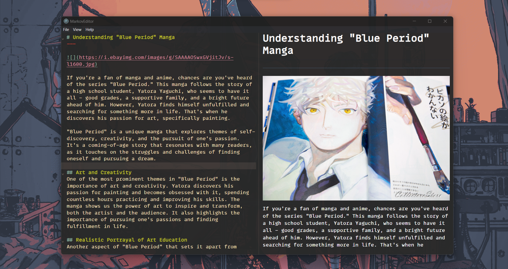

## MarkOvEditor



MarkOvEditor is a simplistic markdown and emacs org mode editor with a viewer to see the changes.
This app was inspired by [craftzdog markdown editor tutorial](https://github.com/craftzdog/electron-markdown-editor-tutorial), but I wanted to implement a org mode support for emacs along with markdown.
<br/>

**Note**: Using chakra seemed like an overkill by the end of the project 😅.

**Technolgies used**:
- [Electron js]()
- [React js]()
- [Recoil js]()
- [Chakra UI]()
- [Unified System]()

**How to use the application:**

---

- The application uses markdown by default if the file isn't saved.
- saving the file enables the user to change the compiler used. eg: saving as ```.org``` allows one to use the org compiler and ```.md``` uses the markdown to compile it to html.
- It initially converts the source to html then to react components.

**What I learned throughout this project**:

---

- How unified js converts markdown into html
- AST tree of markdown and how the compiler works.
- How to build native applications using electron js.
  

### Todo:

--

- [ ] Add local image support